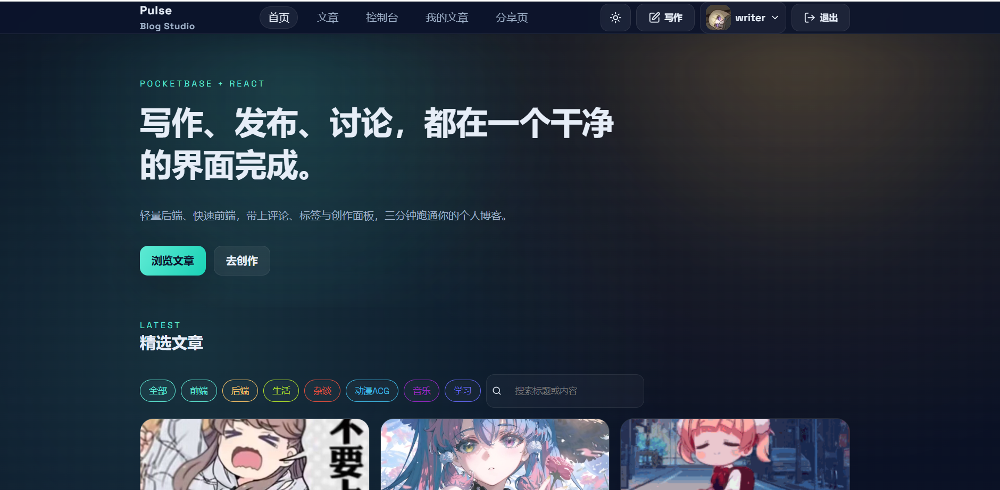
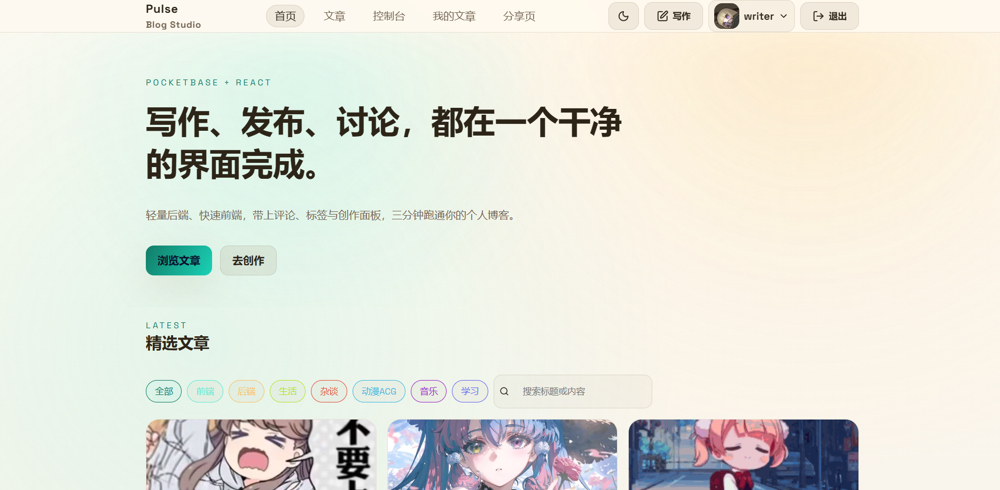
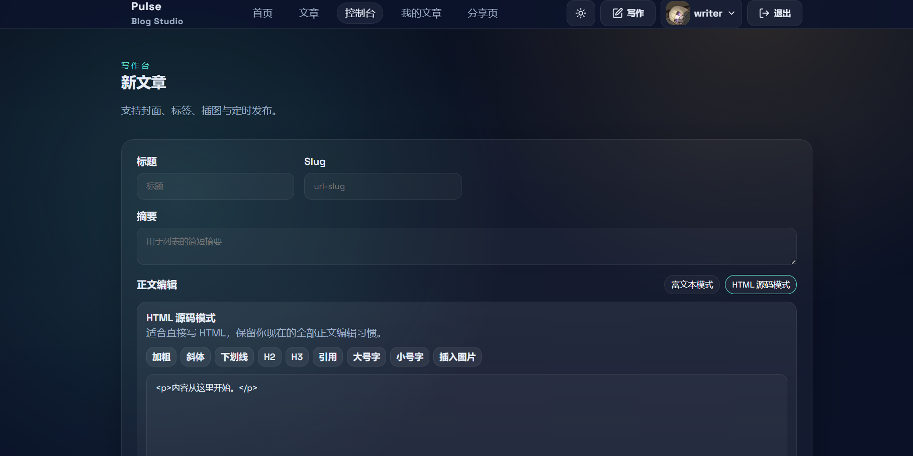
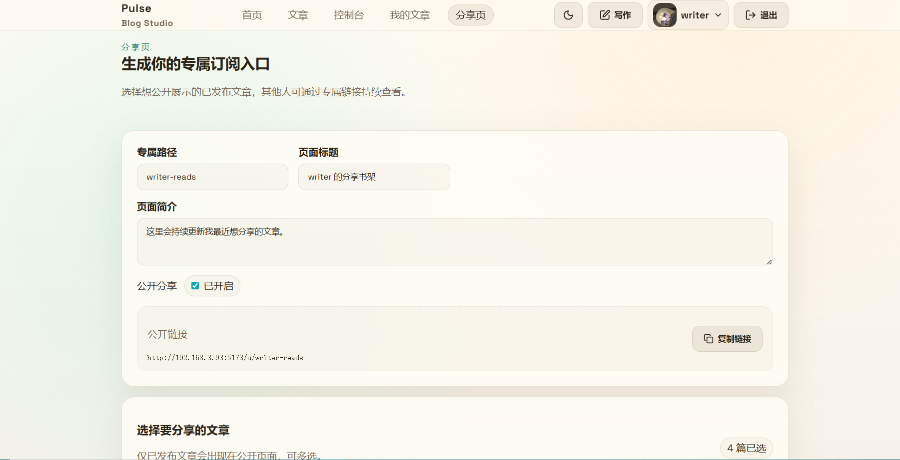

# PocketBase Blog

基于 PocketBase `0.36.6`、React `19`、Vite `7` 的博客项目。  
本项目完全由 OpenAI Codex 开发。

## 功能

- 博客首页、文章列表、文章详情
- 标签筛选、内容搜索、作者搜索
- 评论区
- 后台写作与编辑
- 封面、附件、GIF 图片支持
- 双正文编辑模式
  - HTML 源码模式
  - 富文本模式
- 用户头像与个人资料
- 公开分享页 

## 首次初始化

首次运行一个全新环境时，`pb_migrations/` 里的迁移文件是必须执行的。  
当前仓库共有 7 条迁移，分别负责：

- 创建 `posts`、`tags`、`comments`
- 给用户增加 `profileAvatar`
- 给文章增加 `attachments`
- 增加 `showAttachments`
- 增加 `publishedTz`
- 调整用户可见规则
- 允许 GIF 附件
- 创建 `shares` 分享页集合

如果是第一次启动，请先清空 `pb_data/`，再执行 migration。

如果是迁移已有项目，请保留原 `pb_data/`，不要清空，也通常不需要再手动跑 migration。

## 环境变量

前端主要使用两个环境变量：

```env
VITE_PB_URL=http://127.0.0.1:8090
VITE_APP_URL=http://127.0.0.1:5173
```

- `VITE_PB_URL`
  PocketBase 地址
- `VITE_APP_URL`
  前端站点地址

局域网访问时，这两个地址应改成真实服务器地址。

## Windows

### 1. 初始化数据库

```powershell
cd F:\workspace\codextest\blogByCodex
Remove-Item .\pb_data\* -Recurse -Force
.\pocketbase.exe migrate up --dir=.\pb_data
```

### 2. 启动 PocketBase

```powershell
.\pocketbase.exe serve --http=0.0.0.0:8090 --dir=.\pb_data
```

### 3. 创建超级管理员

```powershell
.\pocketbase.exe --dir pb_data admin create admin@example.com Admin123!
```

### 4. 启动前端

```powershell
cd web
npm install
npm run dev
```

## Linux

### 全新初始化

```bash
cd blogByCodex
rm -rf ./pb_data/*
./pocketbase migrate up --dir=./pb_data
./pocketbase serve --http=0.0.0.0:8090 --dir=./pb_data
./pocketbase --dir pb_data admin create admin@example.com Admin123!
```

```bash
cd /home/user/workspace/blogByCodex/web
npm install
npm run dev
```

### 从 Windows 迁移到 Linux

只需要：

1. 复制整个项目目录
2. 保留原有 `pb_data/`
3. 换成 Linux 版 PocketBase 可执行文件
4. 直接启动

示例：

```bash
cd /home/user/workspace/blogByCodex
./pocketbase serve --http=0.0.0.0:8090 --dir=./pb_data
```

```bash
cd /home/user/workspace/blogByCodex/web
npm install
npm run dev
```

## 常用命令

### 前端

```bash
cd web
npm run dev
npm run build
npm run lint
npm run test:run
```

### 生成示例数据

```bash
cd web
$PB_URL="http://127.0.0.1:8090" \
$PB_ADMIN_EMAIL="admin@example.com" \
$PB_ADMIN_PASSWORD="Admin123!" \
npm run seed
```

## 当前约束

- 正文中的项目内图片不会在数据库里存绝对地址
- 分享页公开链接优先使用 `VITE_APP_URL`
- 搜索支持中文输入法
- 内容搜索会先去掉 HTML 标签，再按正文可见文字匹配

## 页面示意









